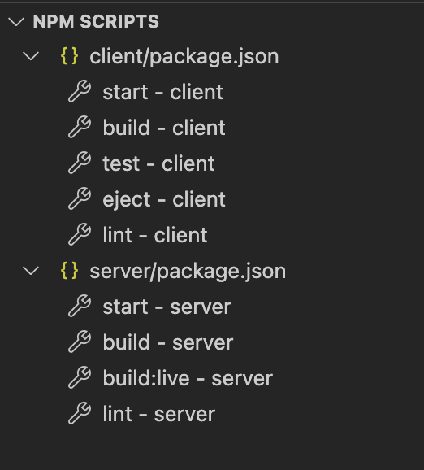
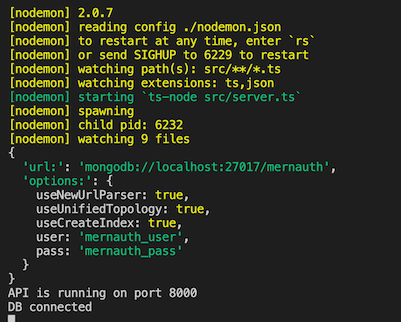

# plist

Plistinator online using MERN stack

# Getting Started

## Local Development

### Pre-requisites & overview

* [Node JS and npm](https://nodejs.org/en/)

The steps are:

* Run a local mongo instance
* Run the server
* Run the client
* Open the client in a browser

Note that shell commands below are run relative to the top directory
of this repository.

### Running a Development Mongo locally

* Install [Docker locally](https://www.docker.com/products/docker-desktop)
* If using VSCode Install the [Docker extension](https://marketplace.visualstudio.com/items?itemName=ms-azuretools.vscode-docker) 
    * More documentation on [the VS Code extension](https://code.visualstudio.com/docs/containers/overview)
    * Or run from the command line:

```bash
docker-compose -f "docker-compose.yml" up -d --build
```

### Run the Server locally

* Use the VSCode `package.json` integration in the node.js extension to run 
    * NPM SCRIPTS > server/package.json > start - server

----



----
* Or run from the command line:

```bash
cd server
nodemon --watch 'src/**/*.ts' --exec "ts-node" src/server.ts
```

The result should look as follows (screenshot from VS Code terminal)



### Run the Client locally

* Use the VSCode `package.json` as for the server above but select
    * NPM SCRIPTS > client/package.json > start - client
    * Or run from the command line:

```bash
cd client
npm start
```

# References

* [wannago.io Typescript Express](https://wanago.io/2018/12/17/typescript-express-error-handling-validation/)
* [Udemy Course: MERN Stack Web Development](https://www.udemy.com/course/mern-stack/)

> MERN Stack Web Development with Ultimate Authentication
> Build Ultimate Authentication Boilerplate Project with 
> MERN Stack from Scratch to Digital Ocean Cloud Servers
